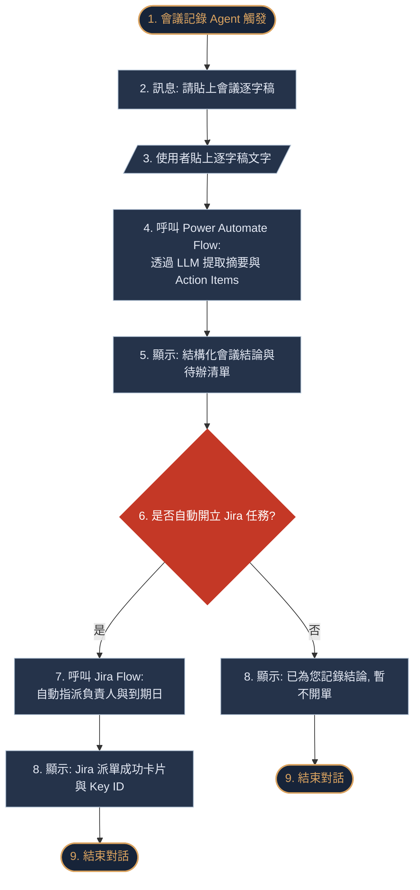
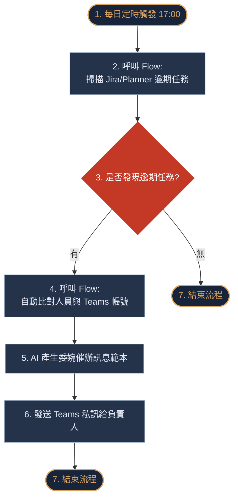

# 企業增效 Agent 可行性評估、競賽簡報與平台建置指南

本文件為「AI PM 專案經理特助：全方位企業增效 Agent」的實作可行性評估、競賽展示簡報大綱，以及 Microsoft Copilot Studio 與 Power Automate 的逐步建置指引。

---

## 壹、 五大 Agent 可行性與資安合規評估

在企業內部（特別是金融與證券環境）部署 AI Agent，必須同時考量「技術實現難度」、「資料安全合規性」與「權限控管障礙」。以下針對 5 大 Agent 進行深度評估：

### 一、 數據 Agent (Data Insights Agent)
* **可行性評估**：中等。
* **開發阻礙與風險**：
  * **Text-to-SQL 準確率風險**：企業內部的 Cube 資料庫結構複雜，LLM 直接生成 SQL 容易產生幻覺，導致查出錯誤的財務或留存數據。
  * **資安權限問題**：神策數據與 Cube 資料庫包含大量敏感的客戶交易行為，直接對外開放 API 查詢存在資安漏洞。
* **調整後之可行方案**：
  * 限制自然語言查詢的範疇，不採用完全開放式的 Text-to-SQL。
  * 在 Power Automate 中建立「預定義參數查詢範本」，限制用戶僅能查詢特定的指標（例如次日留存率、轉化率），並在 API 呼叫前進行嚴格的參數校驗。

### 二、 專案時程管理 Agent (Timeline & Resource Agent)
* **可行性評估**：極高。
* **評估原因**：
  * **微軟生態系整合度高**：Microsoft Planner 與 Teams 屬於企業已啟用的 Office 365 授權範圍，透過 Power Automate 原生 Connector 即可在無須額外開發自訂連接器的情況下安全對接。
  * **智慧催辦合規**：Agent 透過 Teams 發送的訊息，其身分可以設定為執行 Flow 的使用者本人或是特定的企業 Bot，完全符合內部溝通資安規範。

### 三、 提案 Agent (Product Innovation Agent)
* **可行性評估**：極高。
* **評估原因**：
  * **外部檢索安全**：利用 Copilot Studio 內建的「Public Website Web Search」功能（Bing 搜尋引擎對接），無須觸及企業內部敏感資料，不存在資料外洩風險。
  * **文案擴充穩定**：將點子擴充為 User Story 與驗收標準，純粹屬於 LLM 的語意生成強項，技術成熟度高。

### 四、 KPI 管理與儀表板 Agent (KPI & Gap Analysis Agent)
* **可行性評估**：高。
* **評估原因**：
  * **資料來源穩定**：季度 KPI 通常儲存於 SharePoint Online 的 Excel 試算表或 Microsoft Lists，Power Automate 讀取這些資料的技術非常成熟。
  * **落差計算單純**：相較於複雜的預測演算法，Gap 分析僅涉及目標與目前累計值的加減乘除，計算邏輯穩定度高。

### 五、 會議記錄 Agent (Meeting Minutes Agent)
* **可行性評估**：高（若採用手動上傳/貼上逐字稿）；中等（若採用 Graph API 自動存取錄音）。
* **開發阻礙與風險**：
  * **錄音檔存取限制**：自動存取 Teams 會議錄音與逐字稿需要全域管理員（Global Admin）授予極高權限的 Microsoft Graph API 存取權，這在金融安規上極難通過。
* **調整後之可行方案**：
  * 採用「手動貼上逐字稿或會議文字」的模式。PM 開完會後直接將 Teams 生成的逐字稿文字複製並貼給 Agent，再由 Agent 進行摘要與提取。
  * 派單機制部分，透過 Power Automate 串接 Jira API 開單是完全可行且易於稽核的。

---

## 貳、 AI 競賽簡報大綱

以下簡報大綱專為向評審展示「全方位企業增效 Agent」的商業價值與技術可行性而設計。

### 投影片 1：封面
* **標題**：智慧金融時代的 PM 數位分身：全方位企業增效 Agent 實作案
* **副標題**：基於 Copilot Studio 與 Power Automate 的企業級自動化實踐
* **報告人**：永豐金證券數位金融處

### 投影片 2：痛點分析
* **核心問題**：PM 與開發團隊每日耗費大量時間於跨平台溝通與行政庶務：
  * **資訊孤島**：數據庫（Cube/神策）、專案工具（Jira/Planner）與溝通工具（Teams）各自獨立，資料撈取與任務追蹤高度依賴人工。
  * **追蹤滯後**：時程逾期無法即時偵測，會議決策與待辦清單（Action Items）缺乏自動化的閉環管理。

### 投影片 3：系統架構與安規控管
* **架構說明**：以 Microsoft Copilot Studio 為核心入口，透過 Power Automate 作為資料調度中樞。
* **資安防護三箭**：
  * **身分安全**：整合 Azure AD SSO，權限與企業 Active Directory 同步。
  * **資料合規**：敏感資料在傳輸前遮罩去識別化，並在 Power Automate 實施 DLP 策略，防止資料外流。
  * **權限控管**：所有 API 呼叫均採用安全凭证管理。

### 投影片 4：核心 Agent 流程設計：會議記錄與自動派單
* **設計邏輯**：此 Agent 實踐了從「對話輸入」到「系統執行」的完整閉環。
* **對話決策流程圖**：以下為該 Agent 的 Mermaid 流程圖，呈現了從接收逐字稿到 Jira 自動開單的完整分支邏輯（與標準 Copilot Studio 節點完全對應）：



### 投影片 5：核心 Agent 流程設計：時程主動查核與催辦
* **對話決策流程圖**：展示每日傍晚自動偵測看板並發送委婉 Teams 催辦訊息的邏輯：



### 投影片 6：預期效益與商業價值
* **行政減負**：PM 每週整理數據、記錄會議與催辦任務的行政工時降低 40%。
* **專案提速**：任務逾期率降低 25%，時程預警提前 3 天發出，大幅減少專案延宕。
* **數據驅動**：實現決策指標與歷史行銷方案落差的即時比對，加速商務決策。

---

## 參、 Copilot Studio 與 Power Automate 逐步建置指南

本章節指引您如何在 Microsoft 生態系中，從零建置上述的「會議記錄與自動派單 Agent」。

### 第一步：在 Copilot Studio 中建立專案與主題 (Topic)
1. 登入 [Copilot Studio Portal](https://copilotstudio.microsoft.com/)。
2. 點擊「建立一個 Copilot」 (Create a copilot)，為其命名（例如：`企業增效特助`），語系選擇「繁體中文」 (Traditional Chinese)。
3. 進入該 Copilot 實例後，點擊左側選單的「主題」 (Topics) > 「新增主題」 (New topic) > 「從空白開始」 (From blank)。
4. 設定**觸發程序** (Trigger)：
   * 在觸發程序設定中，點擊編輯，並輸入下列 Trigger Phrases：
     * `處理會議記錄`
     * `提取會議待辦事項`
     * `逐字稿派單`
     * `會議結論`

### 第二步：設計對話流節點 (Dialog Nodes)
1. **新增訊息節點**：
   * 在 Trigger 節點下方，點擊 `+` 號，選擇「傳送訊息」 (Send a message)。
   * 輸入文字：`您好，我是會議記錄特助。請提供您的會議記錄或 Teams 逐字稿文字。`
2. **新增問題節點（獲取逐字稿）**：
   * 點擊下方 `+` 號，選擇「詢問問題」 (Ask a question)。
   * 輸入提問：`請直接將逐字稿內容貼在此處：`
   * 在「識別」 (Identify) 欄位選擇 `User's entire response`。
   * 將變數名稱修改為 `Topic.TranscriptText`。
3. **新增動作節點（呼叫 Power Automate）**：
   * 點擊下方 `+` 號，選擇「呼叫動作」 (Call an action) > 「建立流程」 (Create a flow)。
   * 這會自動開啟 Power Automate 設計視窗，並為您建立一個以 Copilot Studio 為觸發源的 Flow 範本。

### 第三步：配置 Power Automate 後端流程 (Flow)
在開啟的 Power Automate 設計畫面中，依據下列步驟配置：

1. **重新命名 Flow**：
   * 將流程名稱修改為 `Extract_Meeting_Minutes_Flow`。
2. **配置輸入變數**：
   * 在 `Power Virtual Agents (V2)` 觸發器中，點擊「新增輸入」 (Add an input)，選擇「文字」 (Text)。
   * 變數名稱設定為 `transcript`。
3. **配置 AI 語言分析（提取 Action Items）**：
   * 點擊 `+ 新增步驟`，搜尋並選擇 `AI Builder` Connector 下的 `Create text with GPT on Azure OpenAI Service` 動作。
   * **指示 (Instructions)** 輸入：
     ```text
     請閱讀以下會議逐字稿，執行兩項任務：
     1. 撰寫 150 字內的會議結論摘要。
     2. 提取出明確的待辦事項清單 (Action Items)，格式為「任務名稱 - 負責人 - 到期日」。
     3. 提取出最急迫的一筆待辦任務，並將其任務名稱、負責人、到期日（格式為 YYYY-MM-DD）分別輸出於最後，以 [TaskTitle]、[Assignee]、[DueDate] 標記開頭與結尾。
     
     會議逐字稿內容：
     @{triggerBody()?['transcript']}
     ```
4. **解析 GPT 輸出變數**：
   * 由於我們需要將提取出的 TaskTitle、Assignee 與 DueDate 分別傳回給 Copilot 作為單獨變數以便於後續的確認與開單，我們可以使用 `Compose`（組合）動作搭配運算式（Expressions）對 GPT 的輸出文字進行分割提取。
   * 範例運算式（用於提取 TaskTitle）：
     `split(first(split(outputs('Create_text_with_GPT')?['body/text'], '[/TaskTitle]')), '[TaskTitle]')[1]`
     *(註：亦可使用 AI Builder 中的「從文字中提取資訊」結構化模型，將其宣告為 entity 輸出。)*
5. **配置輸出變數並回傳**：
   * 在 `Return value(s) to Power Virtual Agents` 動作中，新增下列輸出參數：
     * `Summary` (文字)：帶入 GPT 產出的會議結論。
     * `ActionItems` (文字)：帶入 GPT 產出的待辦清單。
     * `ExtractedTaskTitle` (文字)：帶入解析出的任務標題。
     * `ExtractedAssignee` (文字)：帶入解析出的負責人。
     * `ExtractedDueDate` (文字)：帶入解析出的到期日。
6. **儲存並返回**：
   * 點擊右上角「儲存」 (Save)。儲存完成後關閉此視窗，返回 Copilot Studio 編輯器。

### 第四步：在 Copilot Studio 中建立條件分支 (Conditions)
1. 返回 Copilot Studio 後，在呼叫 Flow 的節點下方，選擇該 Flow (`Extract_Meeting_Minutes_Flow`)，並將輸入變數 `transcript` 對接為 `Topic.TranscriptText`。
2. 將 Flow 回傳的 5 個變數儲存為對應的主題變數。
3. **新增訊息節點**：
   * 點擊 `+` 號，選擇「傳送訊息」 (Send a message)，將 `Summary` 與 `ActionItems` 輸出於對話框中。
4. **新增確認問題節點**：
   * 點擊 `+` 號，選擇「詢問問題」 (Ask a question)。
   * 提問文字設定為：`偵測到一筆明確任務：指派「{Topic.ExtractedAssignee}」於「{Topic.ExtractedDueDate}」前完成「{Topic.ExtractedTaskTitle}」。是否要自動在 Jira/Planner 系統中建立此任務單？`
   * 在「識別」欄位選擇 `Boolean`。
   * 將變數名稱修改為 `Topic.ConfirmDispatch`。
5. **新增條件分支**：
   * 點擊下方 `+` 號，選擇「新增條件」 (Add a condition)。
   * 分支一：當 `Topic.ConfirmDispatch` 等於 `true` 時：
     * 呼叫開單 Action 流程（即串接 Jira Connector 之 Power Automate Flow）。
     * 傳送成功訊息：`成功建立！已於系統建立任務單：{Topic.CreatedIssueKey}`。
   * 分支二：當 `Topic.ConfirmDispatch` 等於 `false` 時：
     * 傳送訊息：`好的，已為您記錄會議結論，暫不進行系統派單。`

### 第五步：發佈與測試
1. 點擊編輯器右上角的「發佈」 (Publish) 按鈕。
2. 在左下角的「測試 Copilot」 (Test copilot) 視窗中，輸入 `處理會議記錄`。
3. 貼上逐字稿，確認 AI 摘要功能是否正常運作，並測試點擊「是」是否能透過 Flow 成功於後端系統開單。
